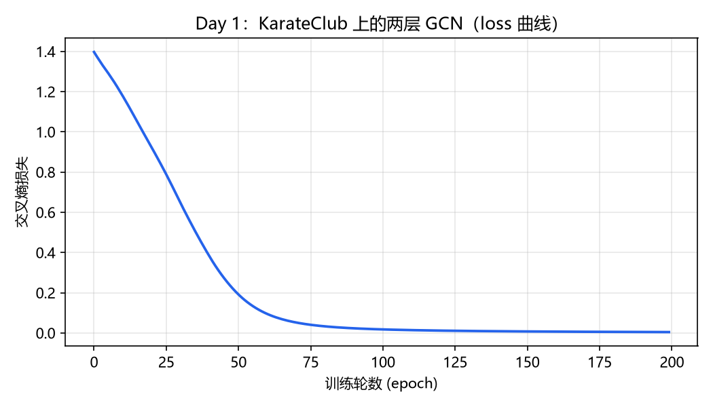

# 01 · Day 1：环境搭建 + 第一个 GNN 实验跑通

> 日期：2026-10-07（提前一天完成）
> 代码：`week1-basics/day1_karate_club.py`
> 环境：`D:\gnn-env`（Python 3.12.10 · torch 2.14.0+cu132 · PyG 2.8.0）

---

## 今日三行总结

- **做了什么**：搭好 gnn 环境（torch + PyG 验证通过），跑通了两层 GCN 在 KarateClub（34 节点 / 156 边）上的节点分类，200 轮训练 loss 1.397 → 0.004，4 个未标注节点预测准确率 80%。
- **卡在哪**：一开始评估准确率只有 0.324，排查发现是初始化代码把优化器绑到了旧模型上（`model, opt = GCN(), torch.optim.Adam(model.parameters(), ...)` 这行的参数指向了旧对象）——教训：训练前打印一次 `len(list(model.parameters()))` 或检查 `opt.param_groups` 确认绑的是同一个模型。
- **明天第一件事**：读 Distill《A Gentle Introduction to Graph Neural Networks》前半部分，然后关掉文章用大白话写"GNN 是怎么工作的"。

---

## 实验记录

**任务**：Zachary 空手道俱乐部节点分类——34 名成员因一次矛盾分裂成两派，只有 4 个节点的派系已知，让 GCN 预测其余节点。

**模型**：`GCNConv(34→16) → ReLU → GCNConv(16→2)`，Adam(lr=0.01)，交叉熵损失，200 epoch。

| epoch | 0 | 20 | 40 | 60 | 80 | 100 | 150 | 199 |
|---|---|---|---|---|---|---|---|---|
| loss | 1.3968 | 0.9209 | 0.3796 | 0.0941 | 0.0326 | 0.0174 | 0.0073 | 0.0042 |

**结果**：全图准确率 82.4%，测试集（4 个未标注节点）80.0%。loss 前 60 轮下降最快，之后进入微调——典型的训练曲线形状。

**三个明天读代码时要回答的问题**（预习）：
1. `data.x`（34×34 单位矩阵）、`data.edge_index`（2×156）、`data.y`（0/1 两派）分别长什么样？
2. `edge_index` 为什么用 `[2, num_edges]` 存储而不是 34×34 邻接矩阵？
3. `data.train_mask` 是怎么标记那 4 个已知节点的？

---

## 踩坑记录

1. **PyTorch 官方源下载极慢**（2.5 GB 的 CUDA 包，代理只有几百 KB/s）→ 解法：复用本机已有的同版本 Python 环境，复制 site-packages，只联网装小的 PyG。
2. **robocopy 在 Git Bash 里要加 `MSYS_NO_PATHCONV=1`**，否则 `/E` 这类参数会被路径转换搞坏。
3. **Windows 上 git 推 GitHub 连不上**：全局代理指向的 10808 端口没开，改用本机 7890 端口后推送成功（已固化到仓库的 git 配置）。

*完成比完美重要。Day 1，收工。*
